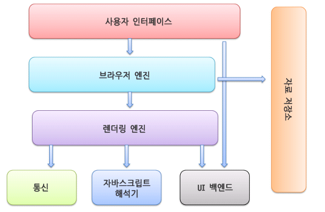

 ## 브라우저 주요 기능
 1. 사용자가 선택한 자원(html, pdf, image)을 서버에 요청, 브라우저에 표시
   
 2. 자원 주소는 URL에 의해 정해진다.
   
 3. 브라우저는 이 html, css명세에 따라 html파일을 해석해서 표시한다.
 명세의 기준은 W3C에서 정해진다.

 4. 사용자에게 필요한 서비스들을 모방하며 갖춰져서 비슷한 인터페이스 요소들이 존재한다.

 ## 브라우저 기본 구조
 

 ### 사용자 인터페이스
 사용자가 활용하는 서비스들

 ### 브라우저 엔진
 사용자 인터페이스, 렌더링 엔진 사이의 동작 제어

 ### [렌더링](렌더링.md) 엔진
 요청한 콘텐츠 표시
