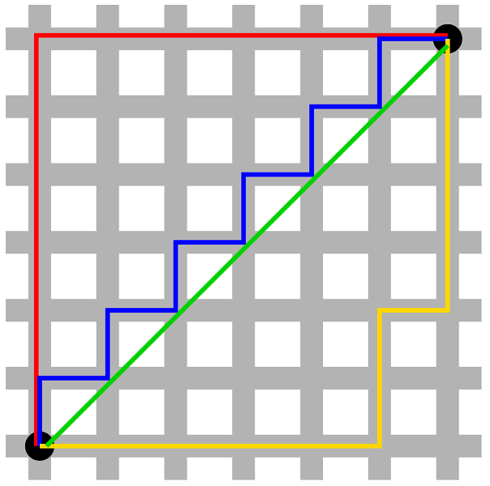

# 멘헤튼 거리
---

각각의 검은 점을 잇는 최소 거리가 파란색이라 생각하지만 실제론 빨간색 파란색 노란색 거리는 같다.
$$|x_1 - x_2| + |y_1 - y_2| $$

멘헤튼 거리의 공식

이 공식을 미로찾기 같은데 사용하는 이유 
1. 멘헤튼 공식은 대각선으로 이동하지않고 수평, 수직으로만 이동하는 거리 좌표를 구하는 공식이기 때문에 동일하게 움직이는 미로에서 유용하다.
2. x좌표, y좌표간 모든 거리의 값을 구하는 공식이기 때문에 거리를 계산하는데 시간이 절약된다.