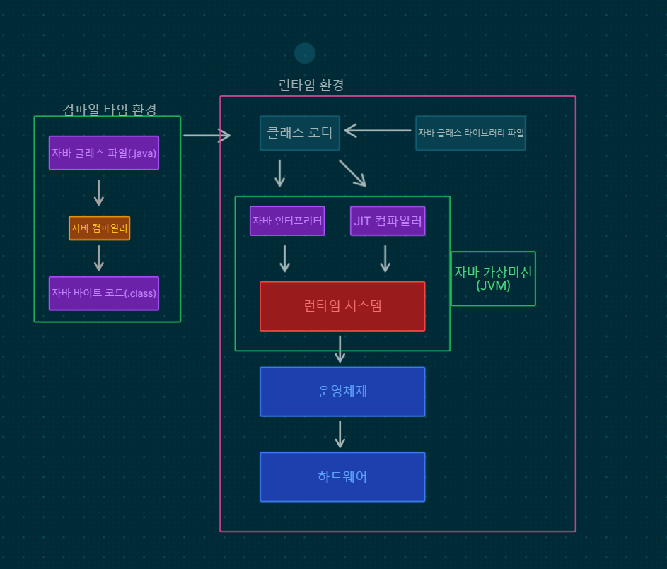

## 클래스 로더
**동적 클래스 로딩 담당**

- JVM이 런타임 중 필요한 클래스를 찾아 로드, 링크, 초기화 과정을 수행
- JVM의 서브시스템, 클래스 파일을 로드할 때 사용
- 자바 프로그램이 실행될 때 가장 먼저 로드됨

## 클래스 영역
**메서드 영역, 클래스별 구조, 메서드 코드가 저장, Static**

- 클래스가 로딩될 때 생성 ~ JVM 종료될 때 까지 유지
- 메서드 영역과 상수 풀이 대표적인 공간
- 클래스 파일을 읽어서 해당 정보를 메소드 영역에 저장
 

## 힙 영역 (낮은 주소)
**객체를 할당할 때, 자바에서 사용되는 모든 인스턴스 변수가 저장**

- 클래스를 객체로 실체화 ( new 키워드로 생성된 객체)의 데이터와 참조 자료형이 저장
- 객체, 배열, **큰 데이터**등이 저장
- 낮은 주소에서 높은 주소 방향으로 할당
### 종류
- 객체 인스턴스

## 스택 영역 (높은 주소)
**자바에서 메소드가 호출시 메소드의 스택 프레임이 저장되는 영역**

- 로컬 변수와 매개변수를 저장
- 가끔 스레드 동시에 생성되는 비공개 JVM스택?
- 후입선출, 가장 늦게 저장된 데이터가 먼저 인출
- 높은 주소에서 낮은 주소 방향으로 할당
### 종류
- 메소드
- 지역변수
- 매개변수

