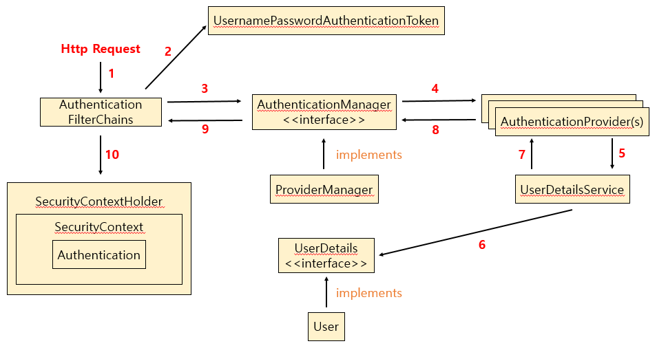

# 1. 스프링 시큐리티(Spring Security) 개요

## 1-1. 스프링 시큐리티란?

- *스프링* 기반의 어플리케이션 보안(인증, 인가 등)을 담당하는 스프링 하위 프레임워크이다.

    

> Spring Security는 강력하고 고도로 사용자 정의 가능한 인증 및 액세스 제어 프레임워크이다. 이것은 사실상 Spring 기반 애플리케이션을 보호하기 위한 표준이다.
>
> Spring Security는 Java 애플리케이션에 인증과 권한 부여를 모두 제공하는 데 중점을 둔 프레임워크이다. 모든 Spring 프로젝트와 마찬가지로 Spring Security의 진정한 힘은 사용자 정의 요구 사항을 충족하기 위해 얼마나 쉽게 확장할 수 있는지에 있다.
>
> 출처 : [스프링 공식 홈](https://spring.io/projects/spring-boot)

## 1-2. 스프링 시큐리티의 특징

- 모든 URL 요청을 가로챈 뒤 인증을 요구하며 login form을 제공한다.

- 여러가지 Servlet API 메소드를 제공한다.(Servlet API 메소드)

  - [Servlet API 메소드들](https://docs.spring.io/spring-security/site/docs/5.0.x/reference/html/servletapi.html)

- 인증 및 권한 부여에 대한 확장이 가능하도록 지원한다.

- 웹 애플리케이션을 *CSRF* 공격으로부터 보호할 수 있다.

  [^CSRF]: 웹 애플리케이션 취약점 중 하나로 사용자가 자신의 의지와 무관하게 공격자가 의도한 행동을 하여 특정 웹페이지를 보안에 취약하게 한다거나 수정, 삭제 등의 작업을 하게 만드는 공격방법

## 1-3. 인증(Authentication)과 인가(Authorization), 보안 주체(Principal)

### 1-3-1. 인증

- 보호된 리소스에 접근하는 사용자를 식별하는 과정으로 사용자를 증명하는 것으로 볼 수 있다.

### 1-3-2. 인가

- 인증된 사용자가 시스템 자원에 대한 접근 시 권한이 있는지 확인하는 과정으로 권한 부여라고 볼 수 있다.
- 인증에 성공하여 인증된 사용자에 대해 인가 절차가 진행된다.

### 1-3-3. 보안 주체

- 보안 시스템이 작동되고 있는 애플리케이션에 접근하는 유저를 말하며 Principal이라고 한다.
- 리소스에 접근하는 대상의 비밀번호는 Credential이라고 한다.

## 1-4. 스프링 시큐리티의 원리

### 1-4-1. 스프링 시큐리티 서블릿 필터

- 스프링 시큐리티에서 요청이 들어오면 해당 요청은 서블릿 필터들로 개발한 시큐리티 필터를 동작작 시키게 되는데 이때 여러가지 필터들이 순서대로 동작한다.(Authentication Filter Chains)

   <table>
       <tr>
       	<th align="center">서블릿 필터</th>
           <th align="center">설명</th>
       </tr>
       <tr>
       	<td align="center">SecurityContextPersistenceFilter</td>
           <td>SecurityContextRepository에서 SecurityContext 객체를 로딩하여 SecurityContextHolder에 저장하고, 요청 처리가 끝나면 제거한다.</td>
       </tr>
       <tr>
           <td align="center">LogoutFilter</td>
           <td>지정한 경로의 요청이 들어오면 로그아웃하고 지정한 페이지로 이동하며 이후 필터들을 진행하지 않는다.</td>
       </tr>
       <tr>
           <td align="center">UsernamePasswordAuthenticationFilter</td>
           <td>로그인 요청이 들어오면 아이디/비밀번호 기반의 인증을 수행하여 성공하면 지정한 페이지로 이동하고 실패 시 로그인 화면을 보여준다.</td>
       </tr>
       <tr>
           <td align="center">DefaultLoginPageGeneratingFilter</td>
           <td>로그인요청이 들어올 시 로그인 화면을 출력하고 이후 필터를 진행하지 않는다.</td>
       </tr>
       <tr>
           <td align="center">AnonymousAuthentiactionFilter</td>
           <td>사용자가 인증을 받지 못할 시 Authentication 객체를 생성하여 SecurityContext에 설정한다. 
       생성된 Authentication의 아이디는 "anonymouseUser"이며 권한은 "ROLE_ANONYMOUS"로 인증되지 않은 상태 값을 가진다.</td>
       </tr>
       <tr>
           <td align="center">SessionManagementFilter</td>
           <td>세션 타임아웃, 동시 접근 제어, 세션 고정 공격등을 처리한다.</td>
       </tr>
       <tr>
           <td align="center">ExceptionTranslationFilter</td>
           <td>FilterSecurityInterceptor에서 발생한 예외를 403 코드로 응답하거나 로그인 페이지로 이동하는 작업을 진행한다.
   </td>
       </tr>
       <tr>
           <td align="center">FilterSecurityInterceptor</td>
           <td>현재 사용자가 지정한 경로에 접근할 수 있는지에 대한 여부를 검사하며 권한이 있으면 보안필터를 통과시켜 자원에 접근시키고 권한이 없으면 예외를 발생 시킨다.</td>
       </tr>
   </table>   

 - 이중 중요한 필터 두가지가 있는데 하나는 인증과 관련된 **UsernamePasswordAuthenticationFilter**로 사용자의 인증 정보를 이용해서 인증을 처리해 준다.

   또 한가지는 인가와 관련된 **FilterSecurityIncerceptor**로 인증에 성공한 사용자가 해당 리소스에 접근할 권한이 있는지를 검증한다.

   인증을 실패하면 로그인 페이지로 인가를 실패하면 권한 없음 페이지를 전송하며 리소스에 대한 접근 차단 역할을 한다.
   
   

### 1-4-2. Security를 통한 전반적인 Login 절차

    

 
- 1 - 브라우저에서 사용자가 입력한 아이디와 비밀번호에 대한 요청이 들어옴
- 2 - **AuthenticationFilter**가 요청을 받아서 **UsernamePasswordAuthenticationToken**을 생성
- 3 - **Authentication** **Manager**가 List형태로 지닌 **Provider**들을 차례로 확인하고 각 **Provider**의 **supports** 메소드를 확인
- 4 - **supports** 메소드를 호출해서 처리 가능한 **AuthenticationProvider**를 선택
- 5 - **UserService**를 구현한 클래스에서 Spring Security가 관리하는 사용자 정보 형태인 **UserDetails**를 반환값으로 가지는 오버라이딩 된 **loadUserByUsername**을 확인
- 6 - 오버라이딩 된 **loadUserByUsername** 메소드의 로직에 따라 DB에서 사용자의 데이터를 꺼내어 **UserDetails**로 반환
- 7 - 인증이 완료되면 인메모리 저장소인 **SecurityContextHolder**가 **SecurityContext**에 **Authentication** 객체를 저장하고 이후 인증된 사용자 정보가 필요 시 **Securitycontextholder.getcontext().getauthentication()**으로 인증된 **authentication**객체를 꺼냄

