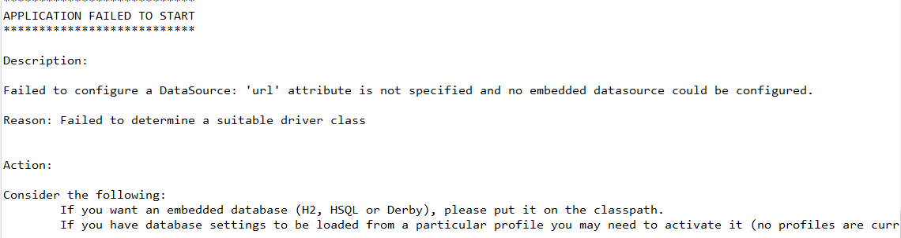

# 2. 스프링 부트(Spring Boot) 시작하기

## 2-1. 스프링 부트 개발 환경 설정하기

### 2-1-1. Spring Initializr 활용하기

- step 1. Spring Initializr 홈페이지로 이동하기
  [Spring Initializr 홈페이지](https://start.spring.io/)

- step 2. 프로젝트 초기 설정 입력하기

  

      
  

- 스타터 설정 항목별 설명
 
  <table>
      <tr>
      	<th align="center">상위 항목</th>
          <th align="center">하위 항목</th>
          <th align="center">설명</th>
      </tr>
      <tr>
      	<td align="center">Project</td>
          <td></td>
          <td>프로젝트를 빌드하고 배포하는 툴을 선택한다. Maven과 Gradle 중 선호하는 툴을 선택한다.</td>
      </tr>
      <tr>
      	<td align="center">Language</td>
          <td></td>
          <td>개발 언어를 선택한다. Java, Kotlin, Groovy를 지원한다.</td>
      </tr>    
      <tr>
      	<td align="center">Spring Boot</td>
          <td></td>
          <td>스프링 부트 버젼을 선택한다.  
  SNAPSHOT : 아직 개발중인 버젼을 의미 
  M1 (Mileston 1) :  특정 기능이 완성되자마자 공개 
  RC (Release Candidate) : 마지막 제품이 될 가능성이 있는 베터 버젼으로 큰 버그가 없는 이상 출시 예정 
  GA (General Availablity) : 필요한 모든 상업화 활동이 완료되어 시장에서 이용 가능 
  RELEASE : 정식 배포 버젼</td>
      </tr>    
      <tr>
      	<td align="center">Project Metadata</td>
          <td></td>
          <td>프로젝트의 정보를 담고 있는 데이터를 설정한다.</td>
      </tr>
          <tr>
      	<td></td>
          <td align="center">Group</td>
          <td>artifact를 만든 조직의 id로 패키지명과 같은 포맷으로 "."으로 계층 구조를 표시한다.</td>
      </tr>
      <tr>
      	<td></td>
          <td align="center">Artifact</td>
          <td>Group에서 만든 artifact들을 구분하기 위한 id로 버젼 정보를 생략한 jar파일의 이름이다. </td>
      </tr>
      <tr>
      	<td></td>
          <td align="center">Name</td>
          <td>빌드되어서 나오는 결과물의 이름</td>
      </tr>
      <tr>
      	<td></td>
          <td align="center">Description</td>
          <td>artifact에 대한 설명이다.</td>
      </tr>
      <tr>
      	<td></td>
          <td align="center">Packaging name</td>
          <td>패키지의 이름을 설정한다. 3레벨 이상으로 설정하며 group id 하위에 artifact name을 사용한다.</td>
      </tr>
      <tr>
      	<td></td>
          <td align="center">Packaging</td>
          <td>artifact가 배포되는 형태로 JAR와 WAR를 선택할 수 있다.</td>
      </tr>
      <tr> 
      	<td></td>
          <td align="center">Java</td>
          <td>JDK 버젼을 선택할 수 있다.</td>
      </tr>
      <tr>
      	<td align="center">Dependencies</td>
          <td></td>
          <td>의존성을 추가해준다. (추가적으로 사용해야 하는 라이브러리가 있는 경우 의존성을 추가한다.)</td>
      </tr>
  </table>

- 작성 예시

  

      
  

- step3. 의존성 추가

  - ADD DEPENDENCIES를 누르면 모달이 나오게 된다.

  

      
  

- 모달창에서 필요한 의존성들을 추가해 준다.

  

      
  

- 추가된 예시

  

      
  

- GENERATE 버튼을 클릭하면 zip 파일 형태로 starter 프로젝트를 내려받을 수 있다.

  

      
  

- 다운로드 받은 후 사용 할 IDE에서 import하면 사용 가능하다.

  

      
  

  
  
- Archive를 눌러 다운로드 받은 Spring Boot 프로젝트를 선택하고 Folder에서는 프로젝트명까지 있는 import as Maven에 해당되는 것만 체그하고 Finish를 하고 잠시 기다리면 Spring Boot 프로젝트를 설정한대로 세팅된 상태로 시작할 수 있다.

  

      
  

- Spring 홈페이지의 Spring Initializr를 사용하는 경우 그냥 실행하면 db연결 관련 에러가 발생한다.

  

      
  

- 따라서 application.properties파일에 포트 및 db연결 관련 설정을 하고 log4와 관련된 설정 파일을 resources에 추가한다.

  

      
  

- 실행해 본다.

  

      
  

  

      
  

### 2-1-2. Eclipse의 Starter 활용하기

- 프로젝트를 생성해 본다.

  

      
  

- Spring 홈페이지와 항목 내용은 다를 바가 없지만 자동으로 수정되지 않는 부분이 있으니 꼼꼼히 확인한다.

  

      
  

- 필요한 라이브러리를 추가한다.

  

      
  

- 이클립스로 생성한 스프링 부트 프로젝트는 db연결 설정을 하지 않아도 실행이 가능하다. 바로 실행해 보자.

  

      
  

