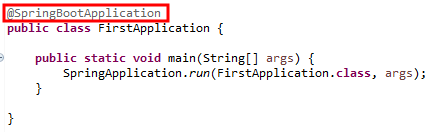
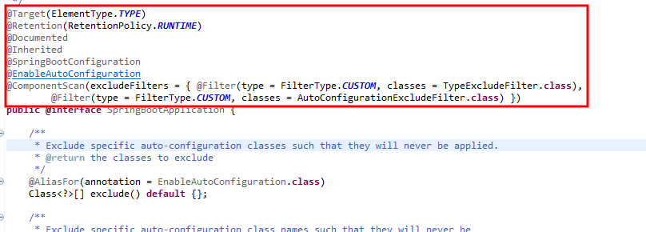
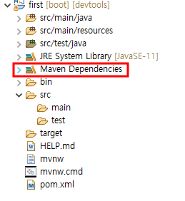
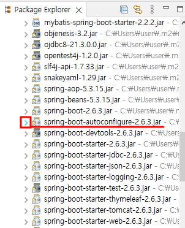
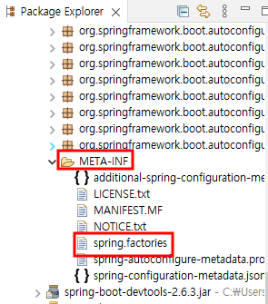
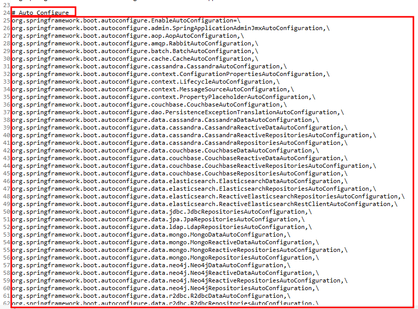
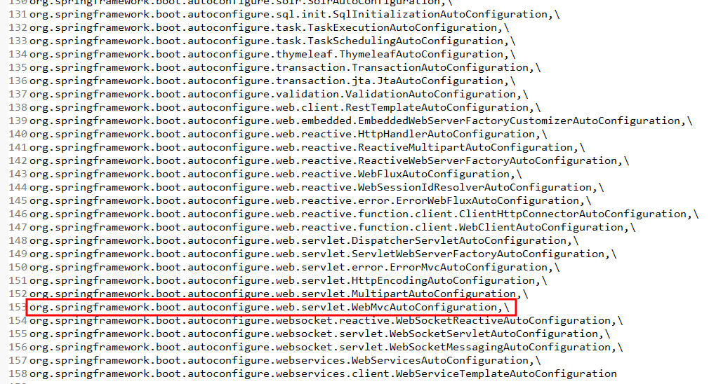
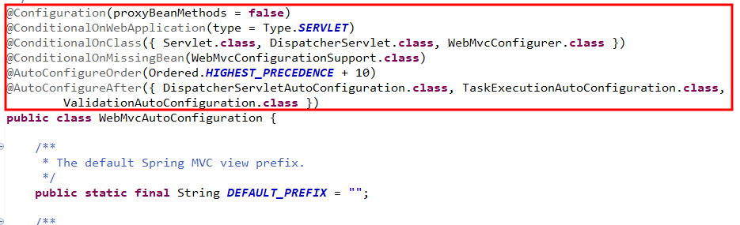
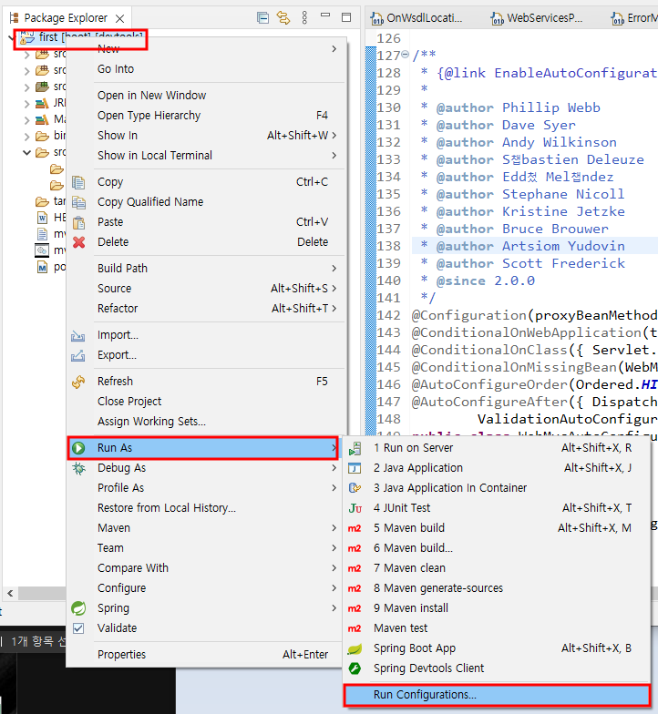
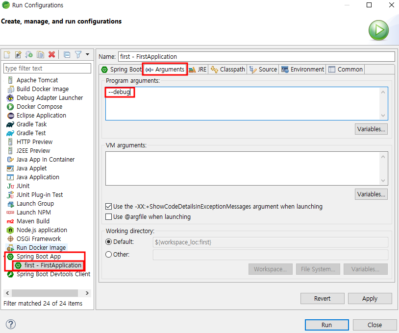

# 3. 스프링 부트(Spring Boot) 자동설정

## 3-1. 자동설정이란?

- 내장 톰캣이 구동되고 스프링 기반의 웹 애플리케이션이 잘 동작하도록 스프링 mvc와 관련된 수많은 빈들이 등록되고 동작할 수 있게 하는 것을 뜻한다. 
- 스프링부트는 스타터와 자동설정을 통해 간단하게 복잡한 설정없이 바로 웹 프로젝트를 시작할 수 있다.

## 3-2. @SpringBootApplication

### 3-2-1. SpringBootApplication 어노테이션

- 스프링부트로 만든 프로젝트의 애플리케이션 실행을 위해 여러가지 설정을 자동으로 할 수 있게 제공되는 어노테이션

- 스프링프로젝트의 메인 메소드가 있는 클래스에 존재한다.

  

      
  

- @SpringBootApplication을 ctrl+마우스 좌클릭을 하면 어노테이션 인터페이스가 나오고 다양한 어노테이션이 있는 것을 확인할 수 있다.

  

      
  

- @SpringBootApplication @interface의 어노테이션들
 
  - 내부의 @Target부터 @Inherited는 단순한 의미로 중요하지 않지만 @SpringBootConfiguration과 @EnableAutoConfiguration, 그리고 @ComponentScan 이 세가지는 중요하다.
  - 스프링부트는 내부적으로 우선 @ComponentScan 어노테이션을 통해 환경설정 클래스 Bean들을 탐색하고 @EnableAutoConfiguration을 통해 자동설정과 관련된 Bean들을 자동 설정한다.

  <table>
      <tr>
      	<th align="center">어노테이션</th>
          <th align="center">설명</th>
      </tr>
      <tr>
      	<td align="center">@Target</td>
          <td>어노테이션이 적용할 위치(클래스, 필드, 메서드)를 결정한다.</td>
      </tr>
      <tr>
      	<td align="center">@Retention</td>
          <td>자바 컴파일러가 어노테이션 값들을 언제까지 유지해서 어느 시점까지 영향을 미칠 것인지를 결정한다.</td>
      </tr>
      <tr>
      	<td align="center">@Documented</td>
          <td>문서에도 어노테이션의 정보가 표현된다.</td>
      </tr>
      <tr>
      	<td align="center">@Inherited</td>
          <td>이 어노테이션을 선언하면 자식클래스가 어노테이션을 상속 받을 수 있다.</td>
      </tr>
      <tr>
      	<td align="center">@SpringBootConfiguration</td>
          <td>스프링에서의 @Configuration과 동일하고 설정 클래스임을 표현한다.</td>
      </tr>
      <tr>
      	<td align="center">@EnableAutoConfiguration</td>
          <td>복잡한 환경 설정을 대신하며 자동설정과 관련된 어노테이션이다.</td>
      </tr>
      <tr>
      	<td align="center">@ComponentScan</td>
          <td>Spring에서 @Configuration, @Controller, @Service, @Repository, @Component가 붙은 객체들을 메모리에 올리는 역할을 한다. </td>
      </tr>
  </table>

- @EnableAutoConfiguration이 스프링 부트의 설정을 구성하기 위해 확인하는 설정파일을 보고 원리를 확인한다.

  - Package Explorer탭을 통해 확인한 프로젝트의 MavenDependencies를 클릭한다.

    

        
    

  - spring-boot-autoconfigure를 열어본다.

    

        
    

  - 아래로 내려가서 META-INF의 spring.factories를 더블클릭한다.

    

        
    

  - Auto Configure라고 주석되어 있는 곳의 클래스들이 모두 환경 설정 클래스들이 등록된 것이다.

    

        
    

  - 이 중에서 웹 애플리케이션과 관련된 설정 클래스를 살펴보자.

    

        
    

  - 패키지를 확인하고 해당 클래스를 찾는다.

    

        
    

  - WebMvcAutoConfiguration 클래스의 어노테이션들을 확인해 보자.

    

        
    

  
    
    <table>
        <tr>
        	<th align="center">어노테이션</th>
            <th align="center">설명</th>
        </tr>
        <tr>
        	<td align="center">@Configuration</td>
            <td>빈 설정 클래스를 의미</td>
        </tr>
        <tr>
        	<td align="center">@ConditionalOnWebApplicatio</td>
            <td>웹 애플리케이션 타입이 어떤 것인지이며 SERVLET일 때(웹 애플리케이션으로 실행할 때) 웹과 관련된 빈들을 초기화 하라는 의미한다.</td>
        </tr>
        <tr>
        	<td align="center">@ConditionalOnClass</td>
            <td>Servlet, DispatcherServlet, WebMvcConfigurer 클래스가 존재하면 설정 클래스가 동작하도록 하라는 의미로 웹을 기반으로 했을 때 설정이 동작함을 의미한다.</td>
        </tr>
        <tr>
        	<td align="center">@ConditionalOnMissingBean</td>
            <td>해당 객체가 메모리에 존재하지 않으면 설정 클래스가 동작함을 의미한다.</td>
        </tr>
        <tr>
        	<td align="center">@AutoConfigureOrder</td>
            <td>자동 설정 클래스의 우선순위가 가장 높은 것보다 10단계 더 높게 설정한 것이다.</td>
        </tr>
        <tr>
        	<td align="center">@AutoConfigureAfter</td>
            <td>DispatcherServletAutoConfiguration, TaskExecutionAutoConfiguration, ValidationAutoConfiguration이 모두 처리된 이후에 적용됨을 의미한다.</td>
        </tr>
    </table>

- 프로젝트 시작 시 Run As에서 Run Configuration 메뉴를 선택하고 Program arguments에 --debug를 추가하여 자동 설정으로 인해 빈들이 메모리에 초기화 되는 것을 확인한다.
  (한번 실행을 하고 Run Configuration으로 들어가야 한다.)

  

      
  

  
  

      
  

  
  ​	

