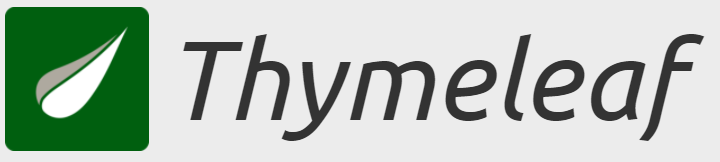
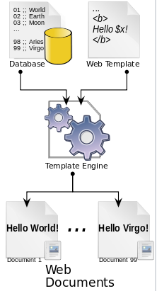

# 1. 타임리프(Thymeleaf) 개요

## 1-1. 타임리프란?

- 타임리프는 스프링 부트에서 공식적으로 지원하는 View 템플릿이다.

    

> Thymeleaf는 웹 및 독립 실행형 환경 모두를 위한 최신 서버 측 Java 템플릿 엔진입니다. 
>
> Thymeleaf의 주요 목표는 귀하의 개발 워크플로에 우아하고 자연스러운 템플릿을 가져오는 것입니다. HTML은 브라우저에 올바르게 표시될 수 있고 정적 프로토타입으로도 작동하여 개발 팀에서 보다 강력한 협업을 가능하게 합니다. 
>
> Spring Framework용 모듈, 선호하는 도구와의 통합 호스트 및 고유한 기능을 플러그인할 수 있는 기능을 갖춘 Thymeleaf는 할 수 있는 것이 훨씬 더 많지만 현대 HTML5 JVM 웹 개발에 이상적입니다.
>
> 출처 : [타임리프 공식 홈](https://www.thymeleaf.org/)

## 1-2. 타임리프의 특징

- JSP와 달리 Thymeleaf 문서는 html 확장자를 갖고 있어 JSP처럼 Servlet이 문서를 표현하는 방식이 아니기 때문에 서버 없이도 동작 가능하다.

- SSR 템플릿으로 백엔드에서 HTML을 동적으로 생성한다.

  [^SSR]: Server Side Rendering을 줄인 말로 서버에서 페이지에 대한 요청에 대해 html과 같은 view 리소스들을 어떻게 보여줘야 할지 해석하고 렌더링하여 사용자에게 반환하는 것을 뜻한다.

- 타임리프는 스프링 부트에서 사용할 것을 권장하고 있고 스프링부트에서 JSP는 별도의 설정이 필요한 반면 타임리프는 바로 적용이 될만큼 스프링과 자연스럽게 통합할 수 있다.

  [^템플릿 엔진]: 데이터와 이 데이터들을 표현 할 템플릿을 결합해주는 도구로 스프링 부트가 지원하는 템플릿 엔진은 Thmeleaf, Freemarker, Mustache, Groovy가 있다.

  

      
  

  
  출처 : [위키피디아](https://en.wikipedia.org/wiki/Web_template_system)

## 1-3. 타임리프의 사용 이유

### 1-3-1. 타임리프의 장점

- Natural Templates를 제공한다.(HTML의 기본 구조를 그대로 사용할 수 있으며 HTML파일을 직접 열어도 동작한다.)

  [^Natural Templates]: 기존 HTML의 마크업 언어를 사용한 디자인 구조로 되어 있는 템플릿으로 서버를 구동하지 않으면 순수 HTML을, 서버를 구동하면 동적으로 HTML이 생성된다. 즉, 순수 HTML을 그대로 유지하면서 뷰 템플릿도 사용할 수 있는 특징이 있다.

- 개발 시 디자인과 개발이 분리되어 작업 효율이 좋다.

- WAS를 통하지 않고도 파일을 웹 브라우저를 통해 열 수 있어 퍼블리셔와 협업이 용이하다.

### 1-3-2. 타임리프의 단점

- jsp태그 라이브러리와 custom태그들을 사용할 수 없어 기존 JSP코드를 재사용할 수 없다.
- 기존 태그를 유지하고 속성으로 템플릿 구문을 넣는데 있어 어느정도 한계가 있고 자바스크립트나 jQuery의 도움이 필요할 수 있다.

## 1-4. 타임리프의 문법

### 1-4-1. 주석

<table>
    <tr>
    	<th align="center">종류</th>
        <th align="center">문법</th>
        <th align="center">설명</th>
    </tr>
    <tr>
    	<td align="center">parser-level 주석</td>
        <td align="center">&lt;!--/* 주석내용 */--&gt;</td>
        <td>parser-level 주석은 정적인 페이지에서는 주석으로 있다가 thymeleaf가 처리될 때 제거되어 
            클라이언트에게 노출되지 않는다는 장점이 있다.</td>
    </tr>
    <tr>
        <td align="center">prototype-only 주석</td>
        <td align="center">&lt;!--/*/ 주석내용 /*/--&gt;</td>
        <td>prototype-only 주석은 정적페이지에서 주석으로 있다가 thymeleaf 처리 후에는 화면에 보여지게  되는 주석</td>
    </tr>
</table>

### 1-4-2. 표현식

<table>
    <tr>
    	<th align="center">종류</th>
        <th align="center">문법</th>
        <th align="center">설명</th>
    </tr>
    <tr>
    	<td align="center">변수 표현식</td>
        <td align="center">${...}</td>
        <td>paramter, session, model 등에 저장되어 있는 변수의 값들을 문자열로 변환하여 불러온다.</td>
    </tr>
    <tr>
    	<td align="center">메시지 표현식</td>
        <td align="center">#{...}</td>
        <td>message source로부터 키에 해당하는 메시지를 가져온다.</td>
    </tr>
    <tr>
    	<td align="center">링크 표현식</td>
        <td align="center">@{...}</td>
        <td>th:href, th:src, th:action 등과 같이 URL이 지정되는 속성에 사용한다.</td>
    </tr>
    <tr>
    	<td align="center">선택 변수 표현식</td>
        <td align="center">*{...}</td>
        <td>부모 태그의 th:object에 지정된 객체를 기준으로 해당 객체의 속성에 접근한다. </td>
    </tr>
    <tr>
    	<td align="center">인라인 표현식</td>
        <td align="center">[[...]], [(...)]</td>
        <td>텍스트 모드나 자바스크립트 모드로 내부에 선언한 변수 표현식의 값을 가져와서 html에 직접 표시한다.</td>
    </tr>
</table>

### 1-4-3. 제어문

<table>
    <tr>
    	<th align="center">종류</th>
        <th align="center">문법</th>
        <th align="center">설명</th>
    </tr>
    <tr>
    	<td align="center">if문</td>
        <td align="center">th:if="${ONGL을 통한 조건식}"</td>
        <td>변수 표현식의 OGNL을 활용한 조건식으로 조건문을 작성하면 결과가 true일 때 해당 태그 범위가 처리된다.</td>
    </tr>
    <tr>
    	<td align="center">else문</td>
        <td align="center">th:unless="${ONGL을 통한 조건식}"</td>
        <td>변수 표현식의 OGNL을 활용한 결과가 false일 때 해당 태그 범위가 처리된다.</td>
    </tr>
    <tr>
    	<td align="center" rowspan="2">다중조건처리문</td>
        <td align="center">th:if="${ONGL을 통한 조건식 and ONGL을 통한 조건식...}"</td>
        <td rowspan="2">변수 표현식의 OGNL을 활용한 조건식들과 and 또는 or를 통해 다중 조건문을 작성하고 결과가 true일 때 해당 태그 범위가 처리된다.</td>
    </tr>
    <tr>
        <td align="center">th:if="${ONGL을 통한 조건식 or ONGL을 통한 조건식...}"</td>
    </tr>
    <tr>
    	<td align="center">switch문</td>
        <td align="center">th:swith="${...}과 th:case="리터럴"</td>
        <td>th:switch와 th:case를 통해 해당 조건의 값이 어떤 case에 해당되는지에 따라 태그를 선택할 수 있다. </td>
    </tr>
    <tr>
    	<td align="center">인라인 표현식</td>
        <td align="center">th:each="변수 : ${collection값}"</td>
        <td>컬렉션에 해당하는 값들을 하나씩 변수에 담아 collection의 크기만큼 반복하여 태그를 처리한다.</td>
    </tr>
</table>

### 1-4-4. SpringEL

- 변수 표현식(#{...})에서 SpringEL을 사용하여 단순한 변수가 아닌 Object, List, Map같은 객체의 값들을 불러올 수 있다.

  [^SpringEL]: 런타임 시 메서드 호출 및 기본 문자열 템플릿 등의 기능을 제공한다.

<table>
    <tr>
    	<th align="center">종류</th>
        <th align="center">문법</th>
        <th align="center">설명</th>
    </tr>
    <tr>
    	<td align="center" rowspan="3">Object</td>
        <td align="center">${객체명.속성명}</td>
        <td rowspan="3">해당 객체의 속성값을 불러온다.</td>
    </tr>
    <tr>
        <td align="center">${객체명['속성명']}</td>
    </tr>
    <tr>
        <td align="center">${객체명.속성의 getter()}</td>
    </tr>
    <tr>
    	<td align="center" rowspan="5">List</td>
        <td align="center">${List객체명[index번째 객체].속성명}</td>
        <td rowspan="5">List에서 index번째 객체의 속성을 불러온다.</td>
    </tr>
    <tr>
        <td align="center">${List객체명[index번째 객체]['속성명']}</td>
    </tr>
    <tr>
        <td align="center">${List객체명[index번째 객체].속성의 getter()}</td>
    </tr>
    <tr>
        <td align="center">${List객체명.get(index번째 객체).속성의 getter()}</td>
    </tr>
    <tr>
        <td align="center">${List객체명.get(index번째 객체).속성명}</td>
    </tr>
    <tr>
    	<td align="center" rowspan="3">Map</td>
        <td align="center">${Map객체명['객체의 키값'].속성명}</td>
        <td rowspan="3">Map에서 키값에 해당하는 객체의 속성을 불러온다.</td>
    </tr>
    <tr>
        <td align="center">${Map객체명['객체의 키값']['속성명']}</td>
    </tr>
    <tr>
        <td align="center">${Map객체명['객체의 키값'].속성의 getter()}</td>
    </tr>
</table>

### 1-4-5. 기타

<table>
    <tr>
    	<th align="center">종류</th>
        <th align="center">문법</th>
        <th align="center">설명</th>
    </tr>
    <tr>
    	<td align="center">타임리프 네임스키마</td>
        <td align="center">xmlns:th="http://www.thymeleaf.org"</td>
        <td>타임리프를 활용하기 위해서는 html의 html태그에 네임스키마로 선언해 주어야 한다.</td>
    </tr>
    <tr>
    	<td align="center">escape 적용</td>
        <td align="center">th:text="${...}"</td>
        <td>변수 표현식의 값을 불러오지만 escape가 적용되어 태그를 단순 문자열로 처리하고 html에 표현한다.</td>
    </tr>
    <tr>
    	<td align="center">escape 미적용</td>
        <td align="center">th:utext="${...}"</td>
        <td>변수 표현식의 값을 불러오지만 escape가 적용되지 않아 태그를 태그로써 인식하게 처리하고 html에 표현한다.</td>
    </tr>
    <tr>
    	<td align="center">value 속성 적용</td>
        <td align="center">th:value="${...}"</td>
        <td>변수 표현식의 값을 불러와 태그의 value값을 지정한다.</td>
    </tr>
    <tr>
    	<td align="center">지역변수</td>
        <td align="center">th:with="변수명1 = ${...},  변수명2 = ${...}, ..."</td>
        <td>변수 표현식(${...})을 통해 불러온 값을 해당하는 변수명으로 해당 태그 범위의 지역변수가 되게 한다.</td>
    </tr>
    <tr>
    	<td align="center">블럭태그</td>
        <td align="center">th:block</td>
        <td>범위를 지정하고 싶을 때 사용한다. 
			th:block을 통해 해당 범위에 변수나 객체를 적용하거나 조건에 해당되는지에 따라 해당 범위를 보여주거나 보여주지 않을 때 사용할 수 있다.</td>
    </tr>
    <tr>
    	<td align="center" rowspan="2">security 인증 정보 여부</td>
        <td align="center">sec:authorize="isAuthenticated()</td>
        <td rowspan="2">타임리프에서 시큐리티 적용 시 로그인, 로그아웃에 대한 이벤트를 줄 수 있다.</td>
    </tr>
    <tr>
        <td align="center">sec:authorize="isAuthenticated() == false"</td>
    </tr>
</table>
 